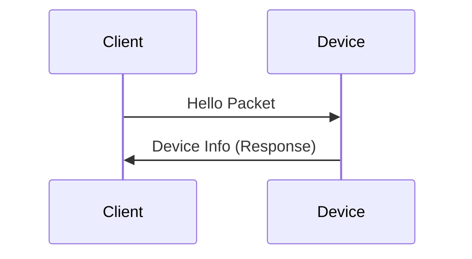
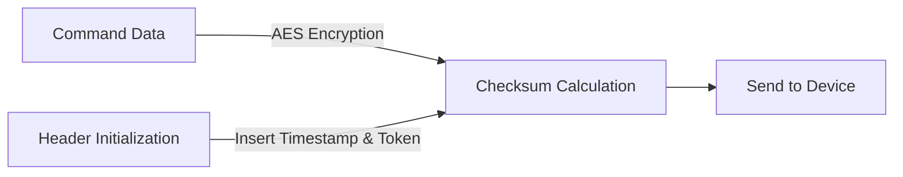

# Analyzing Mi-Home Protocol (Translation by gemini)

While there are many packet-capturing tutorials and DIY projects for the Mi-Home (Mijia) protocol, there isn't much specific analysis available online. This often makes writing code for specific requirements difficult, sometimes even requiring reverse engineering. This article provides a detailed analysis of the overall Mi-Home protocol.

## Packet Protocol

For a large-scale consumer project like Mi-Home, data security is paramount. For example, once a Mi-Home camera is paired, the transmitted data must be protected from interception by third parties. This is achieved through encrypted data packets.

From a design perspective, to construct a packet, the system first needs to identify that the smart home device supports Mi-Home. Therefore, a packet header is required. In the Mi-Home protocol, this is the Magic Number `0x2131`. The packet length must also be provided. For security, the packet includes a unique Device ID (DID), a timestamp, a key/token, a checksum, and—most importantly—the data itself.

The specific format of the Mi-Home packet header is defined as follows:

```c
struct miioheader {
    uint16_t magic = 0x2131; // Magic Number
    uint16_t length;        // Length
    uint32_t pad_unk = 0x0; // Currently unknown, usually set to zero
    uint32_t DID;           // Device ID
    uint32_t stamp;         // Packet timestamp
    union {
        uint8_t token[16];  // Device Token
        uint8_t chksum[16]; // Checksum
    }
};
```

## Handshake Protocol (SmartConnect)

### Hello Packet

The Mi-Home network transmission protocol is based on UDP. Identifying devices is straightforward because we can send a broadcast packet to the `<broadcast>` address via the gateway (home router or smart gateway). Devices that provide a valid response are Mi-Home compatible. This is known as the **Hello Packet**.



The device's response contains basic information. For the Hello Packet specifically, the data consists only of the header mentioned above.

**Hello Packet Content:**

```c
struct miioheader {
    uint16_t magic = 0x2131; // Magic Number
    uint16_t length = 0x20; // Length (32 bytes)
    uint32_t pad_unk = 0x0; 
    uint32_t DID = 0xFFFFFFFF; 
    uint32_t stamp = 0xFFFFFFFF; 
    union {
        uint8_t token[16]; 
        uint8_t chksum[16]; 
        uint128_t hello = 0xffffffffffffffffffffffffffffffff;
    } // Padded with FF
};
```

In the response, the `DID` is replaced with the actual device ID, the `Stamp` is replaced with the device's current timestamp, and the `Token` field returns the device's token.

**Note:** In firmware released after **2017-02-23**, the device only returns the Token during its **first pairing**. In all other Hello Packet responses, this field is padded with `FF`. If the device is already paired, you can retrieve the Token via the Xiaomi Cloud using a [Token Extractor](https://github.com/PiotrMachowski/Xiaomi-cloud-tokens-extractor) or by resetting the device.

## Data Encryption

Mi-Home uses the **AES-128-CBC** algorithm with **PKCS7** padding. The encryption Key and IV (Initialization Vector) are derived as follows:

$$Key = \text{MD5}(Token)$$

$$IV = \text{MD5}(\text{MD5}(Key) + Token)$$

The encrypted data follows the packet header. However, after padding the data, a crucial step remains: **modifying the header**. The Mi-Home protocol strictly validates the header.

1. Fill in the current packet timestamp (relative to the device timestamp; usually `device_timestamp + 1`).
2. Fill the Checksum field with the `Token`.
3. Perform an MD5 check on the **entire packet**.
4. Overwrite the Checksum field with the resulting MD5 hash.

Once these steps are complete, the data can be sent to the device's IP address.



## Device Control Protocol (Instruction Transmission)

The control protocol is simple and uses JSON format, containing:

- **id**: The sequence number of the command (usually starts at 1).
- **method**: The name of the command/method.
- **params**: The parameters required for the command.

Since the implementation of this part is relatively simple and the methods/params vary by device (similar to function calls), this section is less complex. Example:

```json
{
    "id": 1,
    "method": "set_properties",
    "params": [
        {
            "did": "state",
            "value": true
        }
    ]
}
```

## Reference Information

- **Protocol Documentation:** [OpenMiHome Binary Protocol](https://github.com/OpenMiHome/mihome-binary-protocol/blob/master/doc/PROTOCOL.md)
- **Xiaomi Cloud Token Extractor:** [PiotrMachowski / Xiaomi-cloud-tokens-extractor](https://github.com/PiotrMachowski/Xiaomi-cloud-tokens-extractor)
- **Related Projects:**
  - [Gosund-Plug-Remote-Switch](https://github.com/Socular/Gosund-Plug-Remote-Switch)
  - [Mihome-Gosund-Plug-API](https://github.com/Socular/Mihome-Gosund-Plug-API)
