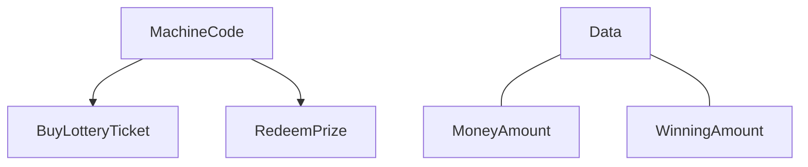
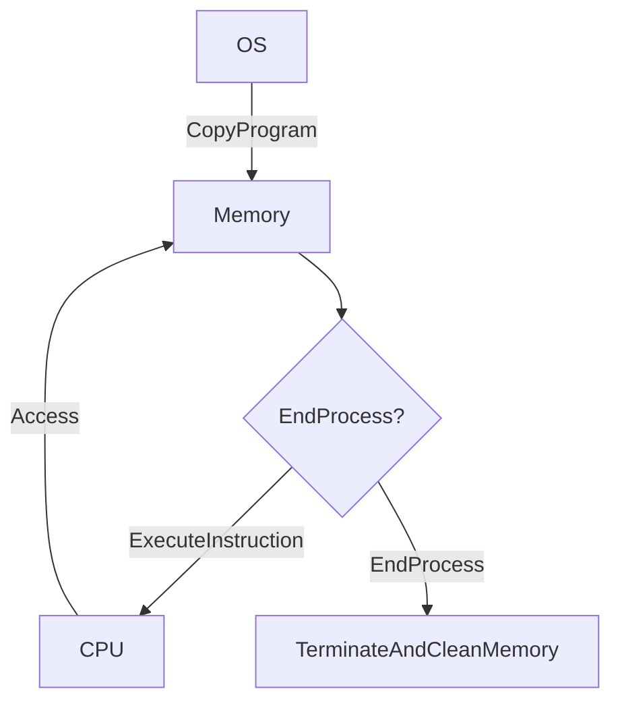

## Operating System's job (Translation by gemini)

We know that in an operating system, double-clicking a program causes it to run. But what does the operating system actually do during this process? First, let's understand the operating system's workflow. According to Wikipedia, the definition of an operating system is:

> An **operating system** (**OS**) is system software that manages computer hardware, software resources, and provides common services for computer programs. Time-sharing operating systems schedule tasks for efficient use of the system and may also include accounting software for cost allocation of processor time, mass storage, printing, and other resources.

In summary, the operating system in our computer primarily performs two types of work: **hardware management** and **application management**. Hardware management is the low-level work of the OS, controlling hardware devices like the CPU, memory, and hard drives. Application management is the program execution we are familiar with. At this stage, we will focus on application management.

Using Windows as an example, when we double-click to run a program, the operating system copies the entire program into memory, including the program's internal data and its machine code. What we want to do is modify the **program in memory** to achieve the functions we desire.

## What is Memory?

In hardware terms, memory is called **Random Access Memory**, abbreviated as RAM. It is a piece of computer hardware that, as the name suggests, is used for **random access**. Random access means that the **time** required to write data is independent of the **location** where it is being written. This gives memory high access speeds. Therefore, rather than executing a program on a hard drive (which has poor random access performance), it is better to copy the program into memory for execution, significantly improving efficiency.

## How Memory Stores Data

As we all know, we need electricity to run computers (at least as of 2020). From this, we can infer that memory also relies on electricity to store data. We use the presence or absence of electrical current to represent 0 and 1, allowing us to store binary data. In an operating system, memory is grouped into sets of 8 storage units. Therefore, the maximum value a group of memory can store is $2^8 = 256$. This group is called a Byte, which is the most basic unit we can access in an operating system.

But why do we define 8 bits as a group? If we use a debugger to read memory data, we'll see that memory contains a wide variety of data. If we represented it in binary, it would look like the image below.

 (1).png>)

Such data looks complex, and programmers would need extensive training to quickly understand binary data, which is not very user-friendly. Thus, genius computer scientists defined 4 bits as a group. Using hexadecimal, we can use 0x0~0xF (where 0x is a prefix indicating a hexadecimal value) to represent values from 0000~1111. This makes it easier for programmers to understand and makes the data more organized and readable. To increase the range, they used two hexadecimal digits to represent 1 byte. For example, 0xFF in binary is 11111111, which equals 256. This makes reading infinitely simpler.

 (1).png>)

*P.S. There is also an octal (0o prefix) representation method, which groups bits into threes. The process is similar and won't be detailed here.*

## How Programs Access Memory

When a program stores data, it first defines a data type and then writes to a corresponding block of memory. But how does the program find the location of this block? In fact, the operating system represents memory block locations using numerical values called **memory addresses**. For example, if I want to visit someone, I need to know their house number to find them. A memory address is like a house number; only with a memory address can you find where the data is stored.

Those who have studied programming know that languages like C have many data types, such as `int`, `double`, and `float`. These types are "multi-byte storage," meaning they use multiple bytes to store data. Taking 32-bit Windows as an example, an unsigned integer (`unsigned int`) occupies 4 bytes, so its storage range is:

$$0 \sim (2^8)^4-1 = 0 \sim 4294967295$$

A signed integer (`signed int`) uses the highest bit as a two's complement bit (to identify whether the value is positive or negative). Therefore, the range for a signed integer is:

$$-2^{8*4-1} \sim 2^{8*4-1}-1 = -2147483648 \sim 2147483647$$

*P.S. Subtracting 1 from the maximum positive value is to account for zero. This is based on total sample calculation rather than simple base conversion, as we need to eliminate duplicates.*

In summary, if we want to retrieve the value at memory address 0x1FF, we first need to know its data type, find the memory location of 0x1FF, determine the data block based on the type, read that block, and then let the program execute the next step.

## Data and Machine Code

*Note: "Data" here refers to software-level data—data in the sense of program logic. If we define the scope at the memory level, everything in memory, including machine code, is technically "data." Thus, our data and machine code are simply numerical values stored in memory that can be modified at any time.*

As mentioned, we modify the copy of the program in memory. This copy contains both data and machine code, both of which are modifiable. What do they represent? Let's use an analogy: we have 100 dollars. We go to a shop and buy a 10-dollar lottery ticket, leaving us with 90 dollars. After the draw, we find the ticket won, and after redeeming it, we get 300 dollars, so we now have 390 dollars. Here, the "data" is the amount of money we have, while actions like buying the ticket and redeeming the prize are controlled by "machine code."

## Difference Between Machine Code and Assembly

Machine code is binary data that can be **directly executed** by the CPU. Programming students know that compiled languages turn high-level code into assembly language. Assembly consists of individual instructions that operate directly on hardware and memory, but the CPU **cannot directly execute** assembly either. Assembly was invented by humans for readability; CPUs don't recognize text. Therefore, assembly is compiled into machine code. Thus, machine code is the lowest-level set of values that can be directly executed.

For example, in an x86 instruction set CPU, the `jmp` operation corresponds to the opcode `E9`. With `0x89AB` as the operand, the instruction is `jmp 0x89AB`. If the current EIP is 0, the machine code for `jmp 0x89AB` would be `E9 00 00 89 AB`. (The value after E9 is a `DWORD` type **relative** address, indicating the distance to jump).

## Overall Program Execution Flow

After reading the above, you should understand the structure of a program in memory. Note that a program can request more memory during execution, so the memory structure is not static (even machine code can change during runtime, such as with extracted shellcode). Once a program is copied into memory, it starts from the **entry point** (the location of the first instruction) and executes instructions one by one from top to bottom. Once finished, the program and OS clean up the memory and exit the process. The flow is as follows:

## Summary

After understanding memory structure and program execution flow, it becomes much easier to grasp memory modification techniques. In the next section, we will explore basic addressing methods and pointers.
