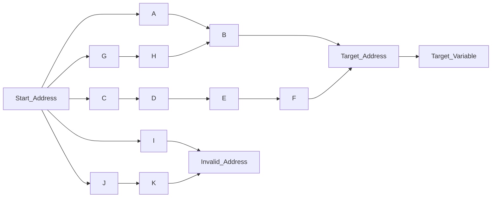

## 1. The Traditional Method: Debuggers

(Translation by gemini)

### Tutorial: Level 1 Pointers (Single Level)

Open the 6th level of the Cheat Engine (CE) text tutorial. The interface looks like this:

 (1).png>)

First, find the address using the methods from the previous section, then use the debugger to find the offset.

Right-click on the address and select **"Find out what writes to this address."** Then, click *Change Value* in the tutorial to modify the memory value. At this point, you will see the instruction that modified this value in the debugger window.

 (1).png>).png>)

**Note (Personal Suggestion):** Try to avoid selecting "Find out what accesses this address" unless there is no way to change the value. Otherwise, you may get flooded with instructions, making analysis much harder. Below is an example of what that results in:

 (1).png>) (1).png>)

As we can see, the instruction modifying the address is `mov [edx], eax`. This moves the value of `eax` into the address stored in `edx`. Since `edx` points directly to our target address here, the offset for this stage is **0**.

Next, we search for the value of `edx` in CE. Clicking the instruction in the debugger shows the current values of all registers; in this case, `edx` is `0x1822170`.

The search results are as follows:

 (1).png>)

We can see that the found address starts with the `.exe` filename (which CE uses to denote a **Base Address**). This means we have reached the initial pointer for the target address. The offset is `+2426B0`. This is a **Level 1 Pointer**.

For multi-level pointers, the process is the same: simply repeat these steps until you find an address that starts with the base module name.

**Note:** Offsets can sometimes be represented as negative values. It is best to record whether they are positive or negative.

In more intuitive terms, this level 1 pointer can be represented as: `Base Address + 0x2426B0 -> 01822170 -> Target Address`

### Practice: Multi-Level Pointers

Let's use a level 4 pointer as an example. Level 8 of the CE tutorial features a similar interface.

 (1).png>)

First, find the address of the variable, then repeat the previous steps. Working backwards, the offsets are `0x0C`, `0x14`, `0`, and `0x18`.

 (1) (1).png>)

In one of the intermediate steps, you might find multiple memory locations storing the same address. However, we only need one **valid** pointer path. You should manually interact with these addresses and use the debugger to see which one is actually accessed by the program to find the valid offset.

In this case, it is a **Level 5 Pointer**. We can use CE's "Add Address Manually" feature to let CE automatically track the pointer path, allowing for persistent control over the variable.

To pass this level, you can simply lock the variable value to 5000.

 (1) (1) (1).png>) (1).png>)

## 2. Pointer Scanning

### Principles

Compared to manual addressing via a debugger, **Pointer Scanning** is simpler and more automated.

Unlike the reverse-engineering process of the debugger, pointer scanning is more of a "brute force" approach. By setting a maximum pointer depth (level) and a maximum offset range, it exhaustively tests values from 0 to the maximum. If a path leads to a **valid data storage area** (like the stack or the application's data region in memory), a pointer path is recorded. If it hits a dead end (an unreadable address), that path is discarded. This is implemented using recursive functions.

The basic logic looks like this:

### Basic Operations

1. First, select **"Generate pointermap"** and save it to a location of your choice.
2. Restart the program (anything that causes the variable's address to change, such as restarting a map in a game; here, we click *Change pointer*).
3. Find the new address of the variable.
4. Use the debugger method once to find the very last offset: `0x18`.
5. Right-click the address and select **"Pointer scan for this address."**

 (1).png>)

Select "Compare with other pointermaps" and check **"Pointers must end with specific offsets,"** then enter the last offset (`0x18`). If you have more information about deeper offsets (e.g., you found the last two levels via the debugger), you can add them by clicking the "Add" button (in this example, we would enter `18` and `0`).

.png>)

Click OK to begin the scan.

You will get a list of pointer paths. In this ideal case, we only get one valid path:

.png>)

**Handling Errors**

If the scan returns thousands or even more results, use the **"Rescan memory"** option in the Pointer Scanner window. You can specify the new target address or the current value of the target variable to filter out invalid paths.

.png>)

Repeat this process about ten times or until the number of paths drops to a manageable few dozen. At that point, the remaining paths are almost certainly all valid. Ideally, you should choose the path with the fewest levels (the shortest list of offsets).
