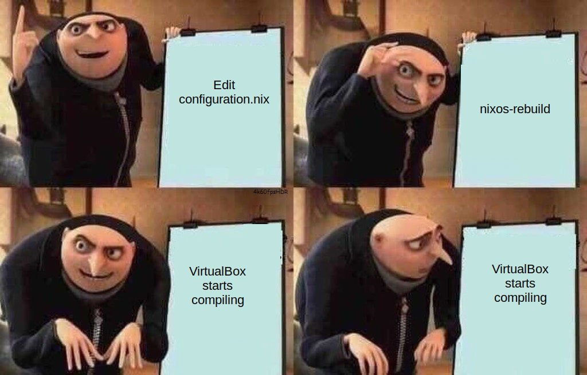
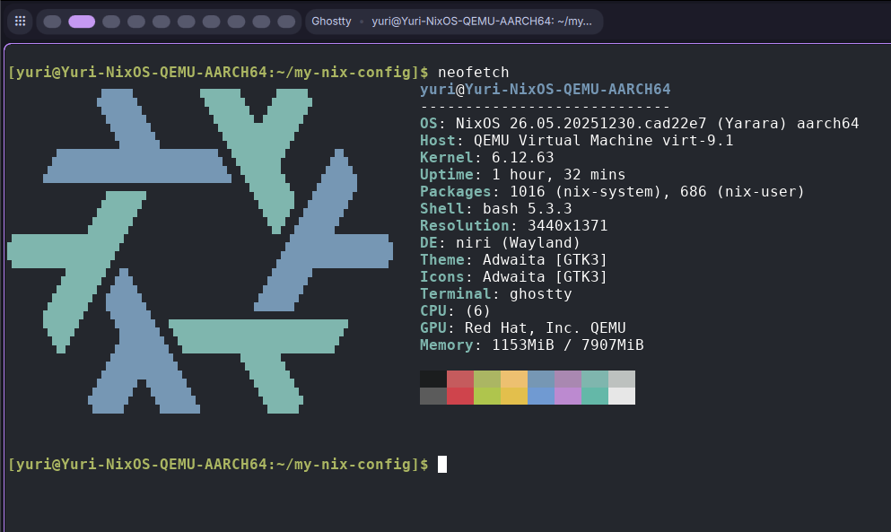

## NixOS

NixOS is a linux distribution, but the entire system is built upon a configuration managed by the Nix Package Manager. This allows users to define and configure everything (e.g. hardware drivers, packages, and even text editors). But this introduces a steep learning curve that scares off many newcomers, including me. This blog post will try to cover everything you need to *start* your NixOS journey. 

### Why you should/shouldn't use NixOS

#### Declarative Configuration

In my perspective, I found NixOS's declarative configuration attracts me the most. I have used Ubuntu, Fedora, Arch, and even Gentoo in the past, but all of these distros breaks at some point, and it took a great amount of time to fix them. One day I gave up fixing my Arch installation, and I went back to Windows, until I found NixOS. NixOS allows me to rebuild my entire config in one command, and since everything is in one configuration, theoretically it would never break.

#### Sandboxing

Each package of NixOS runs in their own sandbox, which has its own environment including all dependencies. This can make users run the latest software without breaking other parts of the system that is still depending on the prior version. Besides, every software can be packaged using a configuration, meaning that everything can be now managed by the Nix package manager. There is no need to manage packages in other managers like go, cargo, gems etc. I used to put a symbolic link into `~/.local/bin` for every user package I installed, and now it won't be necessary.

#### Sometimes NixOS can become Gentoo

Rebuilding a configuration should not take a long time. But if Nix could not find a pre-built binary from [Binary cache](https://cache.nixos.org), it would start compiling from the source, which can take a very long time for packages like LLVM and Qt. (And that is why I left Gentoo.)



#### Error: No space left on device

Since NixOS needs to store every version (and all historical versions) of dependencies, it would use more disk space. This can be problematic on small devices.

### Useful resources

- [Official NixOS Wiki](https://wiki.nixos.org)
- [NixOS search](https://search.nixos.org)
- [MyNixOS][https://mynixos.com]
- [Nix Reference Manual](https://nix.dev)

## Nix language

Nix is a programming language that will be used to build your NixOS configuration. [Nix language basics](https://nix.dev/tutorials/nix-language) covered most syntaxes of this language. This section can be used as a cheat sheet.

### Types

#### Set

- Signature: `{ a, b, c, ... }`, where `a, b, c` are variable names, and `...` means any other attributes.

- Definition:

  ```nix
  { a = 1; b = 2; c = 3; } # Each assignment should be ended with a;
  ```

- Recursive attribute set can be used to access elements inside the set itself when defining.

  ```nix
  rec { a = 1; b = a+1; c = b+1; }
  ```
- Accessing an attribute can be simply done by `.`: `set.attribute`.
  
#### Array

- Definition: `[1 2 3] # separated by whitespace characters.`

#### Function

- Definition: `arg: <expr>`
- Multiple arguments can be achieved by returning another function that takes another argument. `arg1: arg2: <expr> # Haskell moment`
- Or pass a set as argument: `{ arg1, arg2 }: <expr>` / `{arg1, arg1, ...}: <expr>`.

#### Changing the scope
Use `with <set>; <expr>` expression can change the capturing scope of the next expression.
```nix
# set <- { a = 1; b = 2; }
{
	x = with set; [a, b]; # a and b can be captured here.
	y = [a, b]; # But not here
}
```

#### Capturing from the parent scope
Use `inherit <var1> <var2>;` to pass variables from the parent scope. It is equivalent to `x = x; y = y;`.

#### Assigning variables
Use `let <name> = <expr>; <name2> = <expr>; in <expr>` to assign variables to the scope of the next expression.

#### Access variables in string
Just like Bash, variables can be captures in string using `${...}`: `"The value of var is ${var}."`.

### Operators
Here are some useful operators of Nix. More information can be found at [Nix 2.32.5 Reference Manual](https://nix.dev/manual/nix/2.32/language/operators).

- Function application: `<func> <expr>`
- Add/Sub/Mul/Div: `+, -, *, /`
- String/Path concatenation: `+`
- Combine two sets: `<set1> // <set2>`
- List concatenation: `<list1> ++ <list2>`
- Comparison: `!=, ==, <, <=, >, >=`
- Has attribute: `<set> ? <attrpath>`
- Boolean operations: `!, &&, ||, ->`, in which `->` is boolean implication.
- Pipe (experimental): `|>, <|`, which can be used to pass an argument to a function.

## Flakes

Flakes is a feature enabling nix configurations to have its own dependencies. Every dependency would be locked to a specific version in a generated file `flake.lock`. To write a flake, simply add `flake.nix` into your configuration folder. I highly recommend everyone who uses NixOS to use Flakes as it is very convenient and powerful.

### Inputs and Outputs

A flake has the following structure. All inputs will be evaluated before executing outputs function. So `inputs.something.someattribute` refers to `someattribute` inside `something` flake.

```nix
{
	inputs = {
		# Dependencies
		nixpkgs.url = "github:nixos/nixpkgs?ref=nixos-unstable";
	};
	
	outputs = { self, nixpkgs, ... }@inputs: {
		# Access inputs in function arguments
		# With @inputs, you can also access the inputs directly here.
	};
}
```

### Dendritic Pattern

Dendritic Design is a layout to efficiently manage multiple nix files. The [Dendric Design](https://github.com/Doc-Steve/dendritic-design-with-flake-parts/tree/main/guide) guide is a very detailed material to learn about it. It heavily leveraged the advantages of [Flake Parts](https://flake.parts/). In simple words, the Dentritic Pattern made every *features* in your system a flake module, and they can be integrated together using `imports` attribute, which merges imported modules. 

A set will be merged by adding attributes, and a list will be merged by concatenation. A module can be defined in `flake.modules.<class>.<modName>`. Note that `flake` can only be used at the root of the nix file, but it can be passed into the module by using `self` argument. Just be careful not to use `flake` or `self` in an `imports` as it will cause infinite recursion.

Here is an example of enabling SSH server on a host. 

```nix
# sshd.nix
{
  flake.modules.nixos.sshd = {
    services.openssh.enable = true;
    networking.firewall.allowedTCPPorts = [ 22 ];
  };
}

# host.nix
{
  flake.modules.nixos.host-qemu-aarch64 =
    { lib, pkgs, ... }:
    {
      imports =
        with self.modules.nixos; [
          sshd
        ];
    };
}

# flake.nix -> output
{
  flake.nixosConfigurations.qemu-aarch64 = {
  	system = "aarch64-linux";
    modules = [
      inputs.self.modules.nixos.host-qemu-aarch64
    ];
  };
}

```

## Build a NixOS QEMU Guest

### Installation

The installation is pretty simple. First download l ISO image in [NixOS Download](https://nixos.org/download/). A graphical installer is provided and it is the easiest option. You can also try to install it yourself like installing Arch by following [NixOS Manual](https://nixos.org/manual/nixos/stable/#sec-installation-manual).

### Flakes Structure

```plain
features/ -- System functionalities, such as ssh and global packages.
users/    -- User configurations.
hosts/    -- Host configurations.
profiles/ -- System profiles like desktop, server, etc.
lib/    -- Helper functions.
nix.nix -- Stores nix language options.
flake.nix  -- Entrypoint of our configuration
```

### Flake.nix

These inputs are treated as *importing external flakes*. The *follows* option overrides the dependency version of the imported flakes. This is very useful for large inputs like nixpkgs. [Home Manager](https://nix-community.github.io/home-manager/) is used to manage user packages, [import-tree](https://github.com/vic/import-tree) can import all `.nix` files in a directory and all of its subdirectories, and finally [niri-flake](https://github.com/sodiboo/niri-flake/tree/main) adds options to configure [Niri - A scrollable-tiling Wayland compositor](https://github.com/YaLTeR/niri).

```nix
inputs = {
    nixpkgs.url = "github:NixOS/nixpkgs/nixos-unstable";

    home-manager = {
      url = "github:nix-community/home-manager";
      inputs.nixpkgs.follows = "nixpkgs";
    };

    flake-parts = {
      url = "github:hercules-ci/flake-parts";
      inputs.nixpkgs-lib.follows = "nixpkgs";
    };

    niri = {
      url = "github:sodiboo/niri-flake";
      inputs.nixpkgs.follows = "nixpkgs";
    };

    import-tree = {
      url = "github:vic/import-tree";
    };
  };

```

For outputs, the most important part is the *imports* attribute, which imports all nix files in our configuration. The mkHost function accepts a hostname and system type to use [withSystem](https://flake.parts/module-arguments#withsystem) to build a host config. [perSystem](https://flake.parts/best-practices-for-module-writing.html#use-persystem) will put everything defined in the returned set to every hosts.

```nix
outputs =
    inputs@{
      flake-parts,
      home-manager,
      import-tree,
      ...
    }:
    flake-parts.lib.mkFlake { inherit inputs; } (
      top@{
        config,
        withSystem,
        moduleWithSystem,
        ...
      }:
      let
        mkHost = hostname: system: {
          flake.nixosConfigurations."${hostname}" = withSystem system (
            { pkgs, system, ... }:
            inputs.nixpkgs.lib.nixosSystem {
              inherit pkgs system;
              modules = [
                inputs.self.modules.nixos.nix # import nix language config
                inputs.self.modules.nixos."host-${hostname}" # import host config
              ];
            }
          );
        };
      in
      {
        systems = [
          "aarch64-linux"
        ];

        perSystem =
          {
            system,
            inputs',
            ...
          }:
          {
            _module.args.pkgs = import inputs.nixpkgs {
              inherit system;
              overlays = [];
              config = {
                allowUnfree = true;
              };
            };
          };

        imports = [
          # Import necessary modules.
          ./nix.nix
          inputs.flake-parts.flakeModules.modules
          (import-tree ./lib)
          (import-tree ./features)
          (import-tree ./profiles)
          (import-tree ./hosts)
          (import-tree ./users)

          # Make hosts here.
          (mkHost "qemu-aarch64" "aarch64-linux")
        ];
      }
    );
```

### nix.nix

I used `nix.nix` to configure options of nix language and nix package manager. I enabled some experimental-features (flakes is experimental) and configured garbage collection.

```nix
{ ... }:
{
  flake.modules.nixos.nix =
    { ... }:
    {
      nix = {
        settings.experimental-features = [
          "nix-command"
          "flakes"
          "pipe-operators"
        ];

        optimise.automatic = true;
        gc = {
          automatic = true;
          persistent = true;
          dates = "monthly";
          randomizedDelaySec = "45min";
          options = "--delete-older-than 30d";
        };
      };
    };
}
```

### Helper functions

The `lib/` directory stores helper functions added into `flake.lib`. But first we need to define the structure of `flake.lib` using `options` attribute, which defines the type and the method for merging.

```nix
{ lib, ... }:
{
  options = {
    flake.lib = lib.mkOption {
      type = lib.types.attrs;
      default = { };
    };
  };
}
```

To manage modules easily, I used a *prefix* naming method. Such as `flake.modules.nixos.hosts-<hostname>` and `flake.modules.nixos.user-<username>`. The function below returns a set that removed the prefix so we can use `with` expression and access these attributes directly by using `<hostname>`, `<username>`, etc.

```nix
{ self, lib, ... }:
{
  flake.lib.withPrefix =
    prefix: attrs:
    lib.mapAttrs' (n: v: lib.nameValuePair (lib.removePrefix (prefix + "-") n) v) (
      lib.filterAttrs (p: v: (lib.hasPrefix (prefix + "-") p)) attrs
    );

  flake.lib.withUserProfile =
    name: (self.lib.withPrefix "user" self.modules.nixos) |> (self.lib.withPrefix name);
}
```

### User configuration

Each user configuration is stored inside a directory, including user profiles, and user packages (home packages). Also an initial password can also be defined when NixOS is creating an user - but it will not reset the password if the user exists. An example profile `base.nix` is as follows. It defined users and group settings, and enabled home-manager.

```nix
{ self, ... }:
{
  flake.modules.nixos.user-yuri-base =
    {
      pkgs,
      lib,
      ...
    }:
    {
      users.users.yuri = {
        initialHashedPassword = "$2b$05$E6jMmkL6CzIotAr33rISt.TCmfPeexxU6iRM7zXtzmh6Cwfyrq17W";
        isNormalUser = true;
        uid = 1000;
        description = "Sayuri Nekomiya";
        extraGroups = [
          "networkmanager"
          "wheel"
        ];
      };

      # Modules are defined by flake.modules.homeManager.<username>-<modName> 
      home-manager.users.yuri = {
        imports = with self.lib.withPrefix "yuri" self.modules.homeManager; [
          git
          yazi
          helix
          devtools
        ];

        home = {
          username = "yuri";
          homeDirectory = "/home/yuri";
          stateVersion = "26.05";
        };

        programs = {
          home-manager.enable = true;
        };
      };
    };
}
```

Home Manager should also be enabled as a NixOS module.

```nix
# features/home-manager.nix
{
  inputs,
  config,
  ...
}:
let
  home-manager-config =
    { lib, ... }:
    {
      home-manager = {
        verbose = true;
        useUserPackages = true;
        useGlobalPkgs = true;
        backupFileExtension = "bak";
        backupCommand = "rm";
        overwriteBackup = true;
      };
    };
in
{
  flake.modules.nixos.home-manager = {
    imports = [
      inputs.home-manager.nixosModules.home-manager
      home-manager-config 
    ];
  };

  flake.modules.darwin.home-manager = {
    imports = [
      inputs.home-manager.darwinModules.home-manager
      home-manager-config
    ];
  };
}
```

To install a package, simply add packages into `home.packages` in user config. Note that `pkgs` needs to be passed as an argument to the module. It contains every packages found in nixpkgs, and can be configured in perSystem in  `flake.nix`.

```nix
# user/yuri/home/devtools.nix
{ ... }:
{
  flake.modules.homeManager.yuri-devtools =
    { pkgs, ... }:
    {
      home.packages = with pkgs; [
        # CLI data fmt parser
        jq
        yj
      ];
    };
}
```

Configuring home manager options is also very simple. Here is an example of configuring git options. Note that whenever  `programs.<name>.enable` option is available, it would not be necessary to put the program into `home.packages`, as enabling them makes them to be installed automatically. Same applies for `environment.systemPackages` as well.

```nix
# user/yuri/home/git.nix
{ ... }:
{
  flake.modules.homeManager.yuri-git =
    { ... }:
    {
      programs.git = {
        enable = true;
        settings = {
          user.name = "Sayuri Nekomiya";
          user.email = "contactme@awsl.rip";
          init.defaultBranch = "master";
        };
      };
    };
}
```


### GUI configuration

The configuration will use [Niri](https://github.com/YaLTeR/niri) and [DankMaterialShell](https://github.com/AvengeMedia/DankMaterialShell/). Since these packages are included in NixOS options, we do not need to install them again manually.

```nix
# features/niri.nix
{ self, inputs, ... }:
{
  flake.modules.nixos.niri =
    { config, pkgs, ... }:
    {
      imports = [
        inputs.niri.nixosModules.niri
      ];

      programs.niri.enable = true;
      programs.xwayland.enable = true;
      
      # Install system packages
      environment.systemPackages = with pkgs; [
        wl-clipboard
        wayland-utils
        libsecret
        xwayland-satellite
        app2unit
        kdePackages.ark
        nautilus
        pwvucontrol
        udiskie
      ];

      # Env variables can also be configured here
      environment.variables.NIXOS_OZONE_WL = "1";

      # Use UWSM to manage Wayland sessions.
      programs.uwsm = {
        enable = true;
        waylandCompositors.niri = {
          prettyName = "Niri";
          comment = "A scrollable-tiling Wayland compositor";
          binPath = "/run/current-system/sw/bin/niri-session";
        };
      };
    };
}
```

```nix
# features/dms-shell.nix
{ self, ... }:
{
  flake.modules.nixos.dms-shell =
    { ... }:
    {
      programs.dms-shell = {
        enable = true; 
        systemd = {
          enable = true; # Systemd service for auto-start
          restartIfChanged = true; # Auto-restart dms.service when dms-shell changes
        };

        # Core features
        enableSystemMonitoring = true; # System monitoring widgets (dgop)
        enableClipboard = true; # Clipboard history manager
        enableVPN = true; # VPN management widget
        enableDynamicTheming = true; # Wallpaper-based theming (matugen)
        enableAudioWavelength = true; # Audio visualizer (cava)
        enableCalendarEvents = true; # Calendar integration (khal)
      };

      services.displayManager.dms-greeter = {
        enable = true;
        compositor.name = "niri";
        configHome = "/home/yuri";
      };
    };
}
```

### Install QEMU Guest agents

Fortunately NixOS already provided these services so we can enable them directly.

```nix
# profiles/qemu-guest.nix
{ self, ... }:
{
  flake.modules.nixos.profile-qemu-guest =
    { ... }:
    {
      imports = with self.modules.nixos; [
        qemu-share-fs # This will be discussed in the next section
      ];

      services.spice-autorandr.enable = true;
      services.spice-vdagentd.enable = true;

      services.qemuGuest.enable = true;
    };
}
```

### Directory Sharing

QEMU uses 9p file system to share directory. UTM has a [guide](https://docs.getutm.app/guest-support/linux/) to configure `/etc/fstabs`. We can translate it to nixos configuration. BindFS is also used to provide user access to the directory by mapping User IDs. (Otherwise only root can have access to the shared directory)

The `mkQemuShareBindFS` function can be used in user configuration to have a BindFS mount point created for a user.

```nix
# features/qemu-share-fs.nix
{
  config,
  lib,
  ...
}:
{
  flake.modules.nixos.qemu-share-fs =
    { ... }:
    let
      mount_point = "/mnt/share";
    in
    {
      fileSystems."${mount_point}" = {
        device = "share";
        fsType = "9p";
        options = [
          "trans=virtio"
          "version=9p2000.L"
          "rw"
          "_netdev"
          "nofail"
          "auto"
        ];
      };

      system.activationScripts.qemu-share-fs-ensure = {
        text = ''
          mkdir -p /mnt/${mount_point}
        '';
        deps = [ ];
      };
    };

  flake.lib.mkQemuShareBindFS =
    pkgs: username:
    let
      # Use ls -na to get host directory's UID and GID in guest.
      host_uid = builtins.toString 501;
      host_gid = builtins.toString 20;
      mount_point =
        if lib.strings.hasInfix "/" username then username else "/home/${username}/qemu-share";
    in
    {
      system.fsPackages = [ pkgs.bindfs ];

      fileSystems."${mount_point}" = {
        device = "/mnt/share";
        fsType = "fuse.bindfs";
        options = [
          "map=${host_uid}/${username}:@${host_gid}/@users"
          "map-passwd=/etc/passwd"
          "map-group=/etc/group"
          "x-systemd.requires=/mnt/share"
          "_netdev"
          "nofail"
          "auto"
        ];
      };

      system.activationScripts."qemu-share-fs-ensure-${username}" = {
        text = ''
          mkdir -p ${mount_point}
        '';
        deps = [ ];
      };
    };
}
```

Now we need to add another profile in user configuration.

```nix
# users/yuri/qemu-guest.nix
{
  self,
  ...
}:
{
  flake.modules.nixos.user-yuri-qemu-guest =
    {
      pkgs,
      ...
    }:
    {
      imports = with self.modules.nixos; [
        (self.lib.mkQemuShareBindFS pkgs "yuri") # Add the ~/qemu-share mount point.
      ];

      home-manager.users.yuri = {
        # Spawn SPICE agent on QEMU Guests
        programs.niri.settings = {
          spawn-at-startup = [
        	  # Spice-vdagentd needs a client running in Wayland Compositor.
            { sh = "spice-vdagent"; } 
          ];
        };
      };
    };
}
```

### Clipboard Sharing (on Wayland)

Currently there is no solution to use `spice-vdagent` to share clipboard between host and vm. So I developed [Uniclip-rs](https://github.com/YuriNek0/uniclip-rs) to share the clipboard content using TCP connections. We can install uniclip-rs and launch it during the startup of Niri by adding configs below to `home-manager.users.<name>` in the profile above. Then, in your host machine, simply start *uniclip-rs server* by `uniclip-rs -s <bind address>:<port>`.

```nix
home.packages = [
  pkgs.uniclip
];

programs.niri.settings = {
  spawn-at-startup = [
    { sh = "spice-vdagent"; }
    {
      sh = "app2unit -s s -t service -d \"Uniclip-rs clipboard sharing\" -p Restart=always -p RestartSec=5 -- uniclip-rs -p ${self.meta.qemu-host.ip}:${self.meta.qemu-host.uniclip-port}";
    }
  ];
};
```

After niri starts, it will automatically use [app2unit](https://github.com/Vladimir-csp/app2unit) to launch *uniclip-rs* as a systemd service, and restart it when it exits. 

### Profiles and Hosts

In `hosts/<hostname>.nix`, we typically need to configure hardware information and kernel modules specifically for this host, which can be copied directly from `/etc/nixos/hardware-configuration.nix` after a fresh install. The configuration file below added a few other options, including `imports` for profiles and features, `LIBGL_ALWAYS_SOFTWARE` environment variable to resolve an issue when GUI programs failed to render, and kernel modules for QEMU guests.

```nix
{ self, ... }:
{
  flake.modules.nixos.host-qemu-aarch64 =
    { lib, pkgs, ... }:
    {
      imports =
        (with self.modules.nixos; [
          # Home Manager
          home-manager

          # Services
          sshd
        ])
        # Import host profiles.
        ++ (with self.lib.withPrefix "profile" self.modules.nixos; [
          base
          desktop
          qemu-guest
        ])
        # Import user profiles.
        ++ (with self.lib.withUserProfile "yuri"; [
          base
          desktop
          qemu-guest
        ]);

      environment.sessionVariables = {
        LIBGL_ALWAYS_SOFTWARE = "1";
      };
      programs.niri.package = pkgs.niri; # niri-flake only contains x86_64 builds for now. Use nixpkgs instead.

      boot.initrd.availableKernelModules = [
        "xhci_pci"
        "virtio_pci"
        "virtio_net"
        "virtio_pci"
        "virtio_mmio"
        "virtio_blk"
        "virtio_scsi"
        "9p"
        "9pnet_virtio"
        "usbhid"
        "usb_storage"
        "sr_mod"
      ];

      boot.initrd.kernelModules = [
        "virtio_balloon"
        "virtio_console"
        "virtio_rng"
        "virtio_gpu"
      ];
    };
}
```

### Enjoy

The basic setup for a NixOS VM is now complete. Now it's time to apply the configuration. 

1. Navigate to the root of your config.
2. Run `sudo nixos-rebuild boot --flake .#<hostname>`.
3. Wait for the rebuild.
4. If errors occurred, try to fix them and rebuild again.
5. Reboot.



Note that `nixos-rebuild switch` command is also available to directly apply the new config without rebooting. It is very useful for simply installing a new package, but if the config change is large enough that may break the system, I recommend to use `boot` instead.
