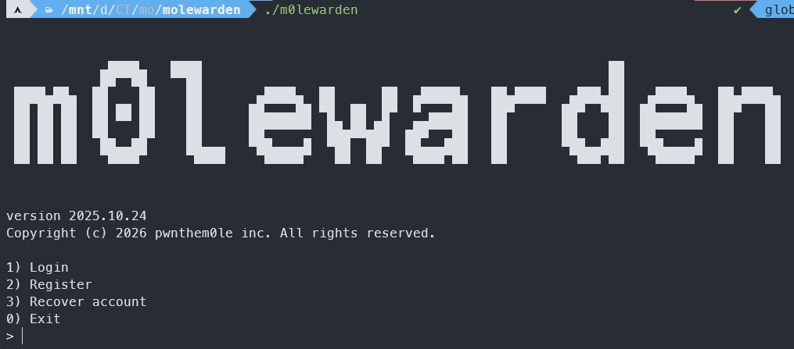
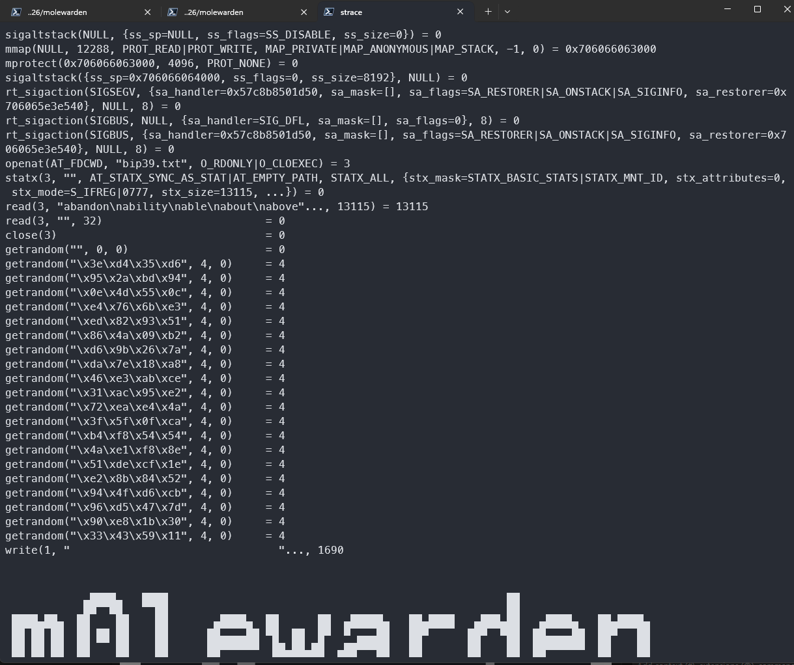
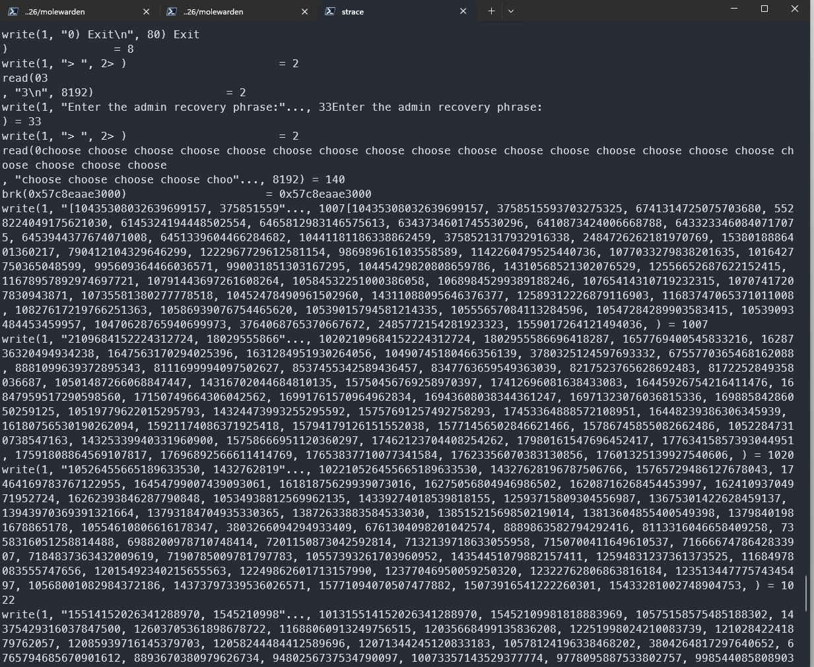
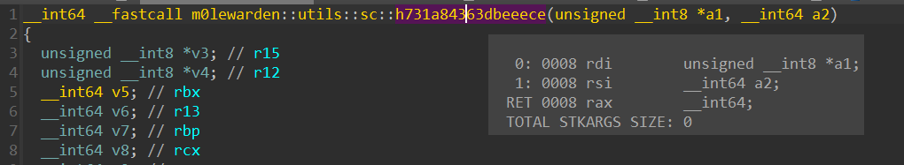
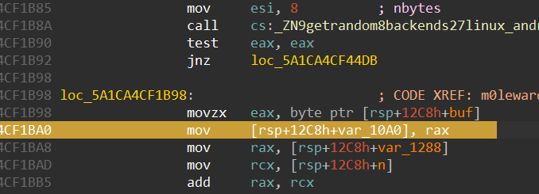
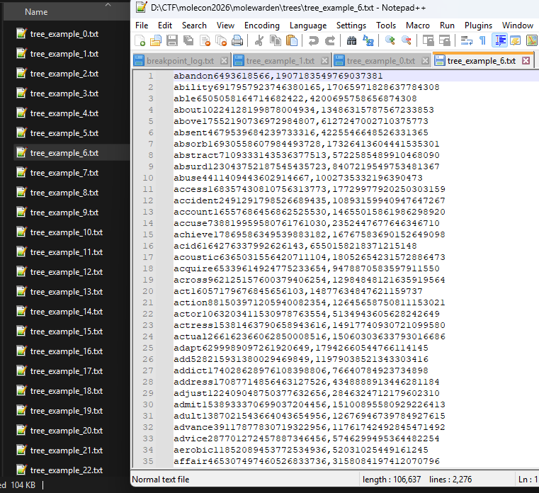
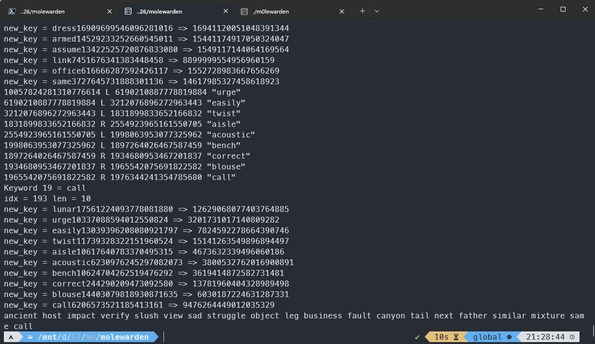
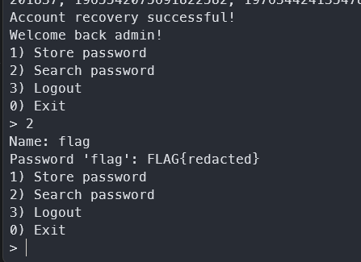

## Background

In [a previous blog post](/reverse-engineering/native-function-hooking-with-frida), I introduced a basic usage of [Frida](https://frida.re), which is also a robust dynamic binary instrumentation framework. It is popular for its Java bridge and it is powerful instrument on Android devices. But sometimes, the Javascript API can be confusing, and no Python APIs are available for now.

In this blog post, I will make a writeup for a CTF challenge ([m0lewarden](./assets/m0lewarden.zip)) in [m0leCon CTF 2026 Teaser](https://ctftime.org/event/2946). When solving this challenge, I used Frida for hooking to call a hash function in the binary, but the terminal stucked with no response. I could not solve the challenge during the CTF (where were other revs?). But I took some times to learn a new dynamic insturmentation [QBDI framework](https://qbdi.quarkslab.com) to solve this challenge. (It also supports Mac and Android with ARM processors.)

## Setup and Install

This blog post will use C++ API only. But the Python API is the most convenient to use, though it has some performance drawbacks. Unfortunately, as the time of writing, some release packages (arch-x86_64) of QBDI framework failed to embed some functions into the pre-compiled static library. I did not submit an issue as I am not sure if it is intended. I recommend to compile the release source code instead.

To compile the source code, we need the following tools:

- Clang
- Ninja
- Git
- C++ Toolchain

```bash
git clone git@github.com:QBDI/QBDI.git
git checkout v0.12.0
mkdir build
cd build
../cmake/config/config-linux-X86_64.sh
ninja
ninja install
```

## QBDIPreload

I choose to use QBDIPreload on this challenge, as it is easier to use C++ to operate on the lower level.

The CMake template can be generated by using `qbdi-preload-template-X86_64`.

## Challenge

The chellenge is a password manager. When the *Recover Account* option is selected, it will ask for 20 recovery phrases. Then it will output an array of numbers. The challenge is to reverse the program to find how these numbers are generated, to restore the admin recovery phrases.



Upon starting, it loads the dictionary `bip39.txt` and reads multiple random numbers from the system.



The key of this challenge is a hash function `m0lewarden::utils::sc::h731a84363dbeeece` . But it is very hard to restore its logic. The best way is to treat it like a black box. The program also have a pseudo-random number generator using XorShift64 for generating hashes of phrases. The initial state of the PRNG an be brute forces as there was only 1 byte.

Upon debugging, it shows a workflow of the following when trying to recover the passphrase:

1. The program generates random numbers on the fly for each words in dictionary. In total there are 2048 words.
2. Concatenate the words with the newly generated numbers to form a new string in `[a-z]+\d+` format.
3. Compute hashes of these words and use them as a key to insert the mapping of <hash, index> to a red-black tree using [RBTree](https://github.com/tickbh/rbtree-rs) library.
4. For each words in the **correct** passphrase, traverse the red-black tree, and for each node in the path, append their hash to an array.
5. After a word's node is located, the program will re-keying all nodes encountered in the path, which involved continuing generating random numbers and appending them to the end of each word, compute new hashes, deleting the original node in the tree, and finally add the new node using the newly generated hash as the key.
6. The final result will be an array of hashes being printed out.



## Mapping words in dictionaries to their hashes

Since we treated the hash function as a black box, we need a way to **call** the function from an external program. Fortunately, the program itself calls the function for all words in the dictionary. The only we need is to extract the <input, output> pairs and put them into a file.

Here is the part where QBDI became useful. It can add **callbacks** when certain addresses have been reached, allowing us to extract useful information in the program's memory or the register states. The function call is pretty standard, using *rdi* as the pointer to the string and *rsi* to be the size of it. The return value will be stored on *rax*.



We also needs to control the initial random seed on *rax* here.



The code for the QBDIPreload:

```c++
#include <bits/stdc++.h>
#include <regex>
#include <cstdlib>

#include "QBDIPreload.h"

int seed;
std::vector<std::pair<std::string, uint64_t>> hashes;
std::string curr_string;

const std::regex hash_str_format("^([a-z]+\\d+)");

static QBDI::VMAction onHashFuncEnter(QBDI::VMInstanceRef vm,
                                      QBDI::GPRState* gprState,
                                      QBDI::FPRState* fprState, void* data)
{
  const QBDI::InstAnalysis* instAnalysis = vm->getInstAnalysis();
  curr_string = std::string(reinterpret_cast<char*>(gprState->rdi));

  // std::cerr << "Debug: std::string: " << curr_string << std::endl
  //           << "       char*: " << reinterpret_cast<char*>(gprState->rdi);

  std::smatch matches;
  if (!std::regex_search(curr_string, matches, hash_str_format)) {
    std::cerr << "Regex unmatched for string: " << curr_string << std::endl;
    return QBDI::STOP;
  }

  curr_string = matches[0].str();
  std::cout << "String matched: " << curr_string << std::endl;

  return QBDI::CONTINUE;
}

static QBDI::VMAction onHashFuncLeave(QBDI::VMInstanceRef vm,
                                      QBDI::GPRState* gprState,
                                      QBDI::FPRState* fprState, void* data)
{
  const QBDI::InstAnalysis* instAnalysis = vm->getInstAnalysis();

  hashes.emplace(hashes.end(), std::move(curr_string), gprState->rax);

  std::cout << "Hash: " << gprState->rax << std::endl;
  return QBDI::CONTINUE;
}

static QBDI::VMAction onRandSeedSet(QBDI::VMInstanceRef vm,
                                    QBDI::GPRState* gprState,
                                    QBDI::FPRState* fprState, void* data)
{

  std::cout  << "Setting random seed: " << seed << std::endl;
  hashes.reserve(3000);
  gprState->rax = seed;
  return QBDI::CONTINUE;
}

extern "C" {

  QBDIPRELOAD_INIT;

  int qbdipreload_on_start(void *main) { return QBDIPRELOAD_NOT_HANDLED; }

  int qbdipreload_on_exit(int status) {
    std::ofstream outFile("trees/tree_example_" + std::to_string(seed) + ".txt");
    if (outFile.is_open()) {
      for (auto [str, hash]: hashes) {
        outFile << str << ',' << hash << std::endl;
      }
    }
    else {
      std::cerr << "Could not open file for writing." << std::endl;
    }

    return QBDIPRELOAD_NO_ERROR;
  }

  int qbdipreload_on_main(int argc, char** argv) {
    return QBDIPRELOAD_NOT_HANDLED;
  }

  int qbdipreload_on_premain(void *gprCtx, void *fpuCtx) {
    return QBDIPRELOAD_NOT_HANDLED;
  }

  int qbdipreload_on_run(QBDI::VMInstanceRef vm, QBDI::rword start, QBDI::rword stop) {
    const char* seed_var = std::getenv("CTF_SEED");
    if (!seed_var) {
      std::cerr << "Seed has not been set. Set seed by: " << std::endl
                << "export CTF_SEED=<0-255>" << std::endl;
      return QBDIPRELOAD_ERR_STARTUP_FAILED;
    }

    seed = std::strtol(seed_var, NULL, 10);
    if (seed < 0 || seed > 255) {
      std::cerr << "Invalid seed value. Set seed by: " << std::endl
                << "export CTF_SEED=<0-255>" << std::endl;
      return QBDIPRELOAD_ERR_STARTUP_FAILED;
    }

    auto map = QBDI::getCurrentProcessMaps();
    uintptr_t base = (uintptr_t)-1;
    std::cout << "Finding Base address. " << std::endl;
    for (auto& mmap: map){
      std::cout << mmap.name << " => 0x" << std::setbase(16)
                << mmap.range.start() << std::setbase(10) << std::endl;
      if (mmap.name == "m0lewarden" && mmap.range.start() < base) {
        base = mmap.range.start();
      }
    }

    if (base <= 0) {
      std::cerr << "Startup failed! Cannot find base address!" << std::endl;
      return QBDIPRELOAD_ERR_STARTUP_FAILED;
    }

    std::cout << "Module Base address: 0x" << std::setbase(16) << base
              << std::setbase(10) << std::endl;

    auto event_id = vm->addCodeAddrCB(base + 0x1DAF0, QBDI::PREINST, onHashFuncEnter, NULL, 0);
    if (event_id == QBDI::VMError::INVALID_EVENTID) {
      std::cerr << "Failed to install hook." << std::endl;
      return QBDIPRELOAD_ERR_STARTUP_FAILED;
    }
    std::cout << "Installed hook " << event_id << " (Hash Func Enter)" << std::endl;

    event_id = vm->addCodeAddrCB(base + 0x1DC90, QBDI::PREINST, onHashFuncLeave, NULL, 0);
    if (event_id == QBDI::VMError::INVALID_EVENTID) {
      std::cerr << "Failed to install hook." << std::endl;
      return QBDIPRELOAD_ERR_STARTUP_FAILED;
    }
    std::cout << "Installed hook " << event_id << " (Hash Func Leave)" << std::endl;

    event_id = vm->addCodeAddrCB(base + 0x19BA0, QBDI::PREINST, onRandSeedSet, NULL, 0);
    if (event_id == QBDI::VMError::INVALID_EVENTID) {
      std::cerr << "Failed to install hook." << std::endl;
      return QBDIPRELOAD_ERR_STARTUP_FAILED;
    }
    std::cout << "Installed hook " << event_id << " (Set Rand)" << std::endl;

    std::cout << "====== START INSTRUMENTATION =====" << std::endl;
    vm->run(start, stop);

    return QBDIPRELOAD_NO_ERROR;
  }
}
```

After compiling with cmake, we can automate the mapping generation by using a bash script.

```bash
for i in $(seq 0 256);
do
  export CTF_SEED=$i
  export LD_BIND_NOW=1
  export LD_PRELOAD=./libqbdi_tracer.so
  echo -e "3\nabandon abandon abandon abandon abandon abandon abandon abandon abandon abandon abandon abandon abandon abandon abandon abandon abandon abandon abandon abandon\n0\n" | ./m0lewarden &
done
```



## Remote procedure call using UNIX named pipe

Although we have a mapping for hashes of the words in dictionary, the real key phrase could not be brute forced, and every time, the path would be different. So we need a way to call the hash function directly. QBDI provides *call* method on the VM class. We can use it directly to call the hash function. But as the RBTree library is written in Rust, we need a way to communicate between the solving program which uses Rust, and the instrumented binary which uses C++. UNIX named pipe could be a simple and easy choice.

We can modify `qbdipreload_on_run` function slightly to achieve this.

```c++
int qbdipreload_on_run(QBDI::VMInstanceRef vm, QBDI::rword start, QBDI::rword stop) {
    auto map = QBDI::getCurrentProcessMaps();
    uintptr_t base = (uintptr_t)-1;
    // std::cout << "Finding Base address. " << std::endl;
    for (auto& mmap: map){
        if (mmap.name == "m0lewarden" && mmap.range.start() < base) {
            base = mmap.range.start();
        }
    }

    if (base <= 0) {
        std::cerr << "Startup failed! Cannot find base address!" << std::endl;
        return QBDIPRELOAD_ERR_STARTUP_FAILED;
    }

    mkfifo("/tmp/pipe_hashing_read", 0666);
    mkfifo("/tmp/pipe_hashing_write", 0666);
    std::ifstream readStream("/tmp/pipe_hashing_read");
    std::ofstream writeStream("/tmp/pipe_hashing_write");
    if (!readStream.is_open()) {
        std::cerr << "IPC pipe could not be opened." << std::endl;
        return QBDIPRELOAD_ERR_STARTUP_FAILED;
    }

    if (!writeStream.is_open()) {
        readStream.close();
        std::cerr << "IPC pipe could not be opened." << std::endl;
        return QBDIPRELOAD_ERR_STARTUP_FAILED;
    }

    std::string input;
    while (std::getline(readStream, input)) {
        const std::vector<QBDI::rword> args = {
            static_cast<QBDI::rword>(reinterpret_cast<uintptr_t>(input.c_str())),
            static_cast<QBDI::rword>(input.length())
        };
        vm->call(NULL, base + 0x1DAF0, std::move(args));
        std::cout << input << " => " << vm->getGPRState()->rax << std::endl;
        writeStream << vm->getGPRState()->rax << std::endl;
    }

    readStream.close();
    writeStream.close();
    return QBDIPRELOAD_ERR_STARTUP_FAILED;
}
```

## Solving the challenge

### Xorshift64

XorShift64 can be implemented easily.

```rust
pub struct XorShiftPRNG64 {
    state: u64,
}

impl XorShiftPRNG64 {
    pub fn new(init: u64) -> Self {
        XorShiftPRNG64 {state: init}
    }

    pub fn next(&mut self) -> u64 {
        let mut state = self.state;
        state ^= state << 13;
        state ^= state >> 7;
        state ^= state << 17;
        self.state = state;
        state
    }
}

```

### Red Black Tree traversal

Traversing a binary tree using the RBTree library is difficult as the actual nodes are private fields. I decided to modify the library directly. to add a public method for this purpose.

```rust
pub fn traverse(tree: &RBTree<u64, String>, path: &Vec<u64>) -> (String, usize) {
    unsafe {
        let mut temp = tree.root.0.as_ref().unwrap();
        assert_eq!(path[0], temp.key);

        let mut i = 0;
        loop {
            if i+1 >= path.len() {
                return (temp.value.clone(), i+1);
            }
            if !temp.left.0.is_null() && (*temp.left.0).key == path[i+1] {
                println!("{:?} L {:?} {:?}", path[i], (*temp.left.0).key, (*temp.left.0).value) ;
                temp = &(*temp.left.0);
            }
            else if !temp.right.0.is_null() && (*temp.right.0).key == path[i+1] {
                println!("{:?} R {:?} {:?}", path[i], (*temp.right.0).key, (*temp.right.0).value);
                temp = &(*temp.right.0);
            }
            else {
                return (temp.value.clone(), i+1);
            }
            i += 1;
        }
    }
}

```

### Solving procedure

1. Load all pairs of <hash, word> into 256 maps, each map corresponds to a seed value.
2. Use another map to map each hash into one seed.
3. Generate 3000 random numbers.
4. Initialize the named pipe and add a `get_hash` function to communicate with QBDI.
5. Reproduce the logic with RBTree inserting and deleting.

```rust
mod xorshift64;
mod rbtree;

use crate::rbtree::traverse;
use crate::xorshift64::XorShiftPRNG64;
use regex::Regex;
use rbtree::RBTree;
use std::fs::{File, OpenOptions};
use std::io::{self, BufReader, BufWriter, prelude::*};
use std::collections::HashMap;

fn main() {
    let mut dictionaries: [RBTree<u64, String>; 256] = std::array::from_fn(|_| RBTree::new());
    let mut set_map: HashMap<u64, usize> = std::collections::HashMap::new();
    let mut rndnums: [[u64; 3000]; 256] = [[0; 3000]; 256];

    let pipe_write_to = OpenOptions::new().write(true).open("/tmp/pipe_hashing_read").unwrap();
    let pipe_read_from = std::fs::File::open("/tmp/pipe_hashing_write").unwrap();
    let re = Regex::new(r"^([a-z]+)\d+$").unwrap();

    for seed in 0..256 {
        let mut rng = XorShiftPRNG64::new(seed as u64);
        for i in 0..3000 {
            let hash = rng.next();
            rndnums[seed][i] = hash;
        }

        let filename = format!("trees/tree_example_{}.txt", seed);
        let file = File::open(filename).unwrap();
        let reader = BufReader::new(file);

        let mut i = 0;
        for lines in reader.lines() {
            let line = lines.unwrap();

            if i >= 2048 {
                break;
            }

            if line.trim().is_empty() {
                continue;
            }

            let result : Vec<&str> = line.split(",").collect();
            let keyword = re.captures(result[0].to_string().as_str()).unwrap()[1].to_string();
            dictionaries[seed].insert(result[1].parse::<u64>().unwrap(), keyword);
            set_map.insert(result[1].parse::<u64>().unwrap(), seed);
            i += 1;
        }
    }

    let mut pipe_writer = BufWriter::new(pipe_write_to);
    let mut pipe_reader = BufReader::new(pipe_read_from);

    let mut get_hash = |input: &String| {
        let mut input = input.clone();
        let mut result: String = String::new();
        input.push('\n');
        pipe_writer.write(input.as_bytes()).unwrap();
        pipe_writer.flush().unwrap();
        pipe_reader.read_line(&mut result).unwrap();
        result.trim().parse::<u64>().unwrap()
    };
    let mut input = String::new();

    io::stdin().read_line(&mut input)
        .expect("Failed to read line");
    input = input.replace(" ", "");
    println!("Got: {:?}", input);

    let trimmed_input = input.trim();
    // use , to separate numbers;

    let expected_hashes: Vec<u64> = trimmed_input.split(',').map(|x| {
        println!("Got: {:?}", x.trim());
        x.trim().parse::<u64>().unwrap()
    }).collect();
    let mut counter: [usize; 256] = [0; 256];

    for hash in &expected_hashes {
        if let Some(target_seed) = set_map.get(&hash) {
            counter[*target_seed] += 1;
        }
    }

    println!("Counter = {:?}", counter);

    let tree_seed = counter.iter().enumerate().max_by_key(|&(_, &value)| value).map(|(idx, _)| idx).unwrap();
    println!("Tree seed = {:?}", tree_seed);

    // dictionaries[tree_seed].print_tree();

    let tree: &mut RBTree<u64, String> = &mut dictionaries[tree_seed];
    let mut result: [String; 20] = std::array::from_fn(|_| String::new());

    let mut idx = 0;
    let mut rnd_idx = 2048;
    for i in 0..20 {
        let (key, len) = traverse(tree, &expected_hashes[idx..].to_vec());
        result[i] = key.clone();
        println!("Keyword {} = {}", i, key);
        println!("idx = {} len = {}", idx, len);

        for j in idx..idx+len {
            let key = tree.get(&expected_hashes[j]).unwrap().clone();
            let key_hash_pin = format!("{}{}", key, rndnums[tree_seed][rnd_idx]);
            let new_key = get_hash(&key_hash_pin);
            tree.remove(&expected_hashes[j]);
            tree.insert(new_key, key.clone());
            println!("new_key = {} => {:?}", key_hash_pin, new_key);
            rnd_idx += 1;
        }

        idx += len;
    }

    println!("{}", result.join(" "));
}

```

### Result




